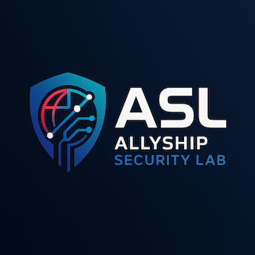
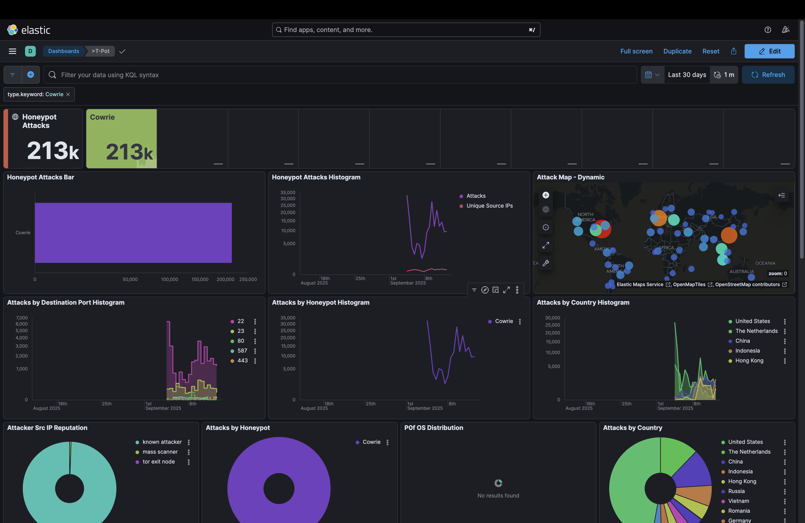
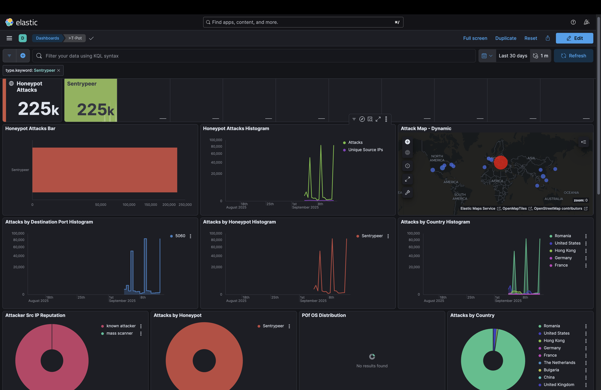
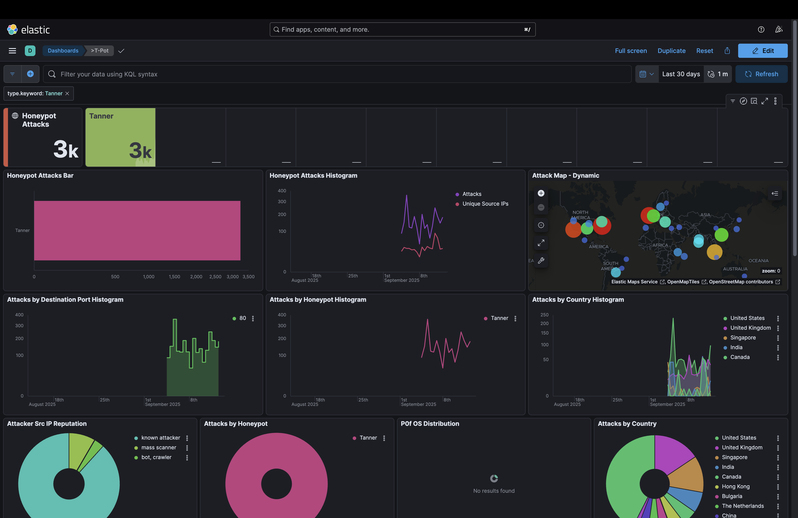
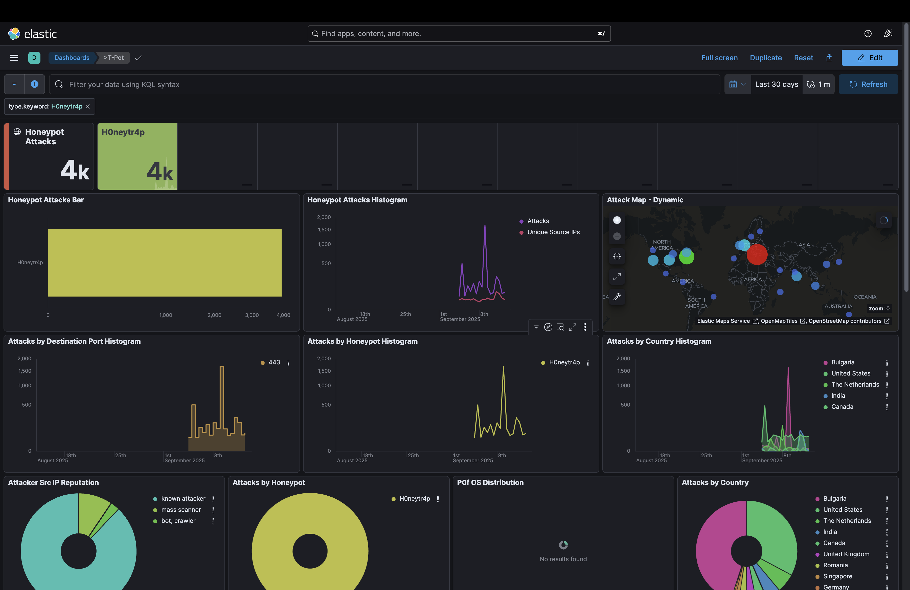
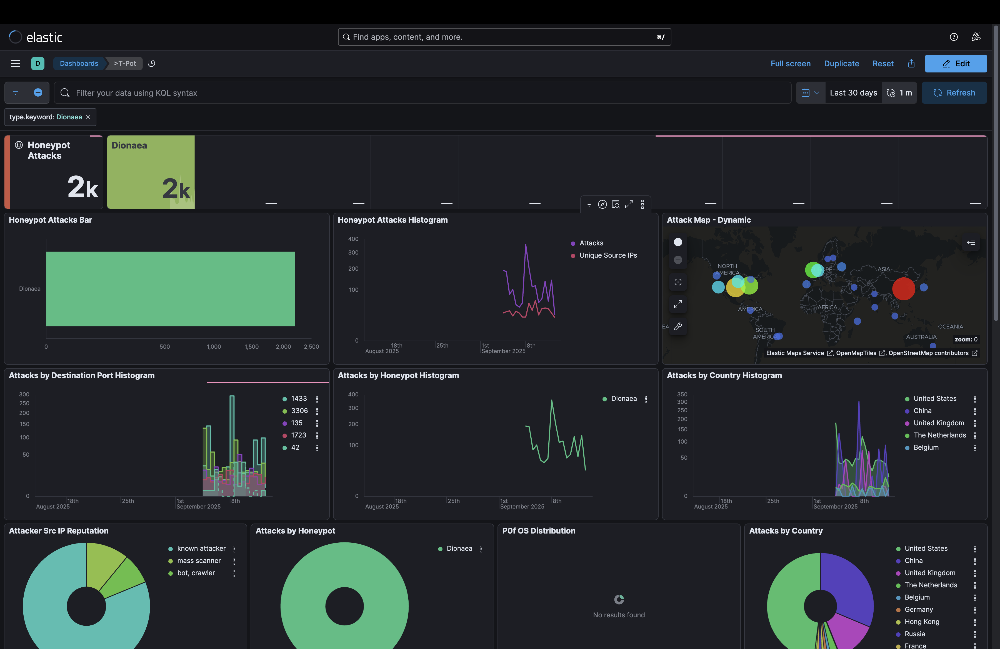
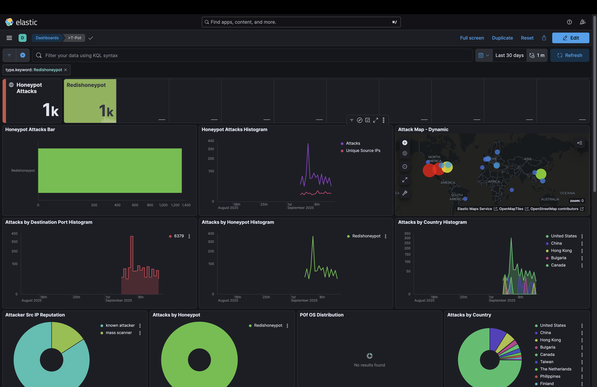
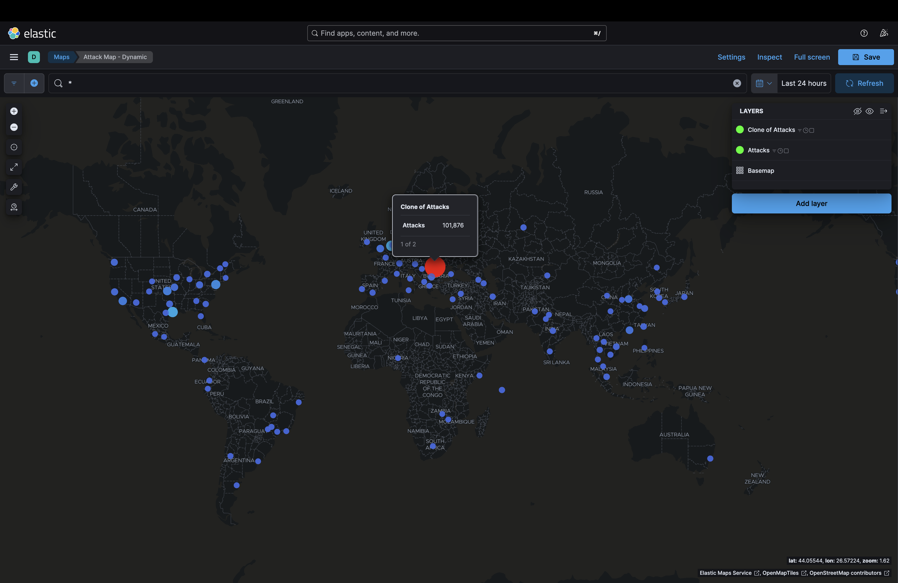
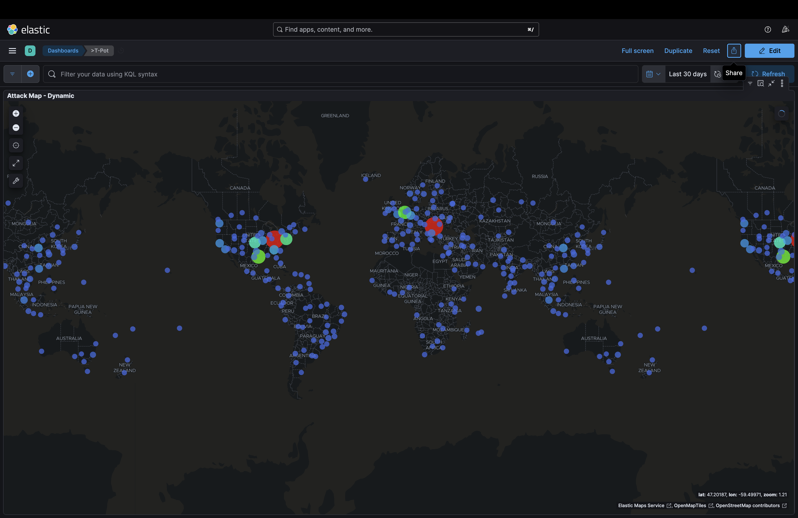

# 🛡️ Allyship Security Labs: Advanced T-Pot Honeypot with Zero-Trust Architecture

---

## 🚀 Project Overview

This research project deployed a **T‑Pot honeypot on Microsoft Azure** with enhanced security controls via **NetBird** and **Elastic Fleet Agents (ingested into a locally deployed Security Onion)** to capture and analyze real‑world cyber attacks while maintaining a **zero‑trust architecture**. Over the final 7‑day window, the deployment captured **451,000+ attack attempts** across multiple honeypots. In parallel, Security Onion recorded **18,300,651+ host telemetry events (Sep 4–13)** from the T‑Pot system and endpoints over the NetBird WireGuard network, providing comprehensive visibility into both external attacks and internal system behavior. NetBird's overlay network enabled secure, on‑the‑go access (including mobile) to dashboards and detections while away from home.

> **🔄 Project Evolution**: This research builds upon the [Allyship Security Lab VPN - Cloud-Local SIEM](https://github.com/yourusername/allyship-securitylab-VpNSIEM) infrastructure, demonstrating the evolution from basic SIEM setup to advanced threat intelligence collection with enhanced security controls.

## 📚 Documentation

**📖 [Complete Documentation Index](docs/README.md)** - Comprehensive documentation portal

### Quick Access
- **🚀 [Setup Guide](docs/setup-guide.md)** - Complete deployment instructions
- **⚡ [Quick Start](docs/quick-start.md)** - Rapid deployment for experienced users  
- **🔧 [Troubleshooting](docs/troubleshooting.md)** - Common issues and solutions
- **🏗️ [Architecture Overview](docs/context.md)** - Technical architecture and design decisions

### Configuration Guides
- **🖥️ [Azure VM Setup](docs/azure-configuration/vm-configuration.md)** - VM provisioning and configuration
- **🔒 [Network Security](docs/azure-configuration/nsg-rules.md)** - NSG rules and firewall configuration
- **🔐 [SSL Configuration](docs/azure-configuration/ssl-configuration.md)** - Let's Encrypt certificate setup

### Security & Monitoring
- **🛡️ [Zero-Trust Architecture](docs/security-enhancements/zero-trust-architecture.md)** - Advanced security implementation
- **🔗 [NetBird Integration](docs/security-enhancements/netbird-integration.md)** - Secure network access
- **📊 [Elastic Fleet Setup](docs/security-enhancements/elastic-fleet-setup.md)** - Comprehensive monitoring

### Research Findings
- **📈 [Attack Analysis](docs/research-findings/attack-analysis.md)** - Detailed attack pattern analysis
- **🎯 [Threat Intelligence](docs/research-findings/threat-intelligence.md)** - Threat actor insights
- **🌍 [Top Attackers](docs/research-findings/top-attackers.md)** - Geographic attack distribution

### 🎯 Key Technologies
- **T-Pot** - The All-In-One Multi Honeypot Platform
- **Azure VM + Azure Blob Storage** - Cloud infrastructure hosting and durable data retention
- **Security Onion** - Local SIEM for centralized analysis
- **Elastic Stack** - Kibana dashboard, Elasticsearch OSQuery for data storage and Host Queries
- **Let's Encrypt** - SSL/TLS certificate management (Although Netbird Already provides wireguard secured tunnel)
- **NetBird** - Zero-trust network access- Installed accross all endpoints endpoints for NAT Passthrough, Secured Local/Cloud connections, Access control to determine which endpoints have access when at home or away from home. (This is particular useful to be able to quickly view Security Onions Dashboards and Detections through Netbird 100.x.x.x/16)
- **Elastic Fleet Agents** - Behavioral monitoring and log forwarding from all Local/Cloud endpoints to SIEM.
- **OsQuery** - Query endpoints

## 🏗️ Architecture Evolution

This project represents the **next evolution** of my Allyship Security Labs infrastructure. While my previous project established secure network connectivity between environments using NetBird and Security Onion, this honeypot deployment demonstrates how to securely expose internet-facing services while maintaining complete visibility and control.

### 🔧 Enhanced Architecture Components
- **🔐 NetBird Zero-Trust Access**: Replaced direct SSH access with NetBird-managed WireGuard tunnels (connect/Access endpoints only with Netbird's IPs)
- **📊 Elastic Fleet Integration**: Deployed agents to monitor host behavior and securely forward logs to local Security Onion (Again using Netbird's wireguard IPs , this ensures all data in-transit is encrypted and secured between endpoints)
- **🎯 Comprehensive Threat Intelligence**: Captured and analyzed real-world attack patterns with behavioral context from T-port internet facing live attacks capture.

## 🎯 Project Highlights

| Metric | Value | Description |
|--------|-------|-------------|
| 🎯 **Total Attacks (7 Days)** | 451,000+ | Final captured attacks across all sensors |
| 🐝 **Per‑Honeypot Totals** | Cowrie 213k • Sentrypeer 225k • Tanner 3k • H0neytr4p 4k • Dionaea 2k • Redishhoneypot 1k | From Kibana dashboards |
| 📊 **Host Events (Sep 4–13)** | 18.3M+ | Security Onion (Elastic Fleet + Osquery) |
| 🌍 **Top Countries** | Romania, United States, The Netherlands, China, Hong Kong | Leading attack sources |
| 🔐 **Zero-Trust** | ✅ | NetBird-managed access |
| 📊 **Dual Monitoring** | ✅ | Attack + Host behavior analysis |
| 🛡️ **Compliance** | ✅ | Azure & GDPR compliant |

### 🚀 Key Achievements
- **🎯 Captured 451,000+ attack attempts in 7 days** using a securely isolated honeypot
- **📊 Collected 18.3+ million host/endpoint events** via Elastic Fleet + Osquery into Security Onion
- **🔐 Implemented zero-trust access model** with NetBird-managed WireGuard tunnels (replacing direct SSH access)
- **🔄 Dual monitoring architecture** combining external attack capture (T-Pot) with internal host behavior analysis (Elastic Fleet)
- **🔍 Analyzed attack patterns** including SIP attacks (port 5060), SSH brute-forcing (port 22), and web attacks (ports 80/443)
- **✅ Ensured compliance** with Azure terms of service and GDPR requirements for research data

## 🏛️ Technical Architecture

The enhanced T-Pot deployment features a multi-layered security architecture that goes beyond standard honeypot implementations:

### 🔄 Architecture Flow
1. **🌐 Attackers** → Target Azure VM (T-Pot honeypots)
2. **🕸️ T-Pot** → Captures and logs all attack attempts (451,000+ in 7 days)
3. **📊 Elastic Fleet Agents** → Monitor host/endpoint behavior (18.3M+ events observed Sep 4–13)
4. **🔐 NetBird** → Secure WireGuard tunnels (100.66.x.x/16) for zero-trust data forwarding
5. **🛡️ Security Onion** → Centralized SIEM processing both attack data and host monitoring events

### 🧩 Key Components
- **🕸️ Honeypots**: Sentrypeer (~225k), Cowrie (~213k), H0neytr4p (~4k), Tanner (~3k), Dionaea (~2k), Redishhoneypot (~1k)
- **📊 Elastic Fleet Agents**: Process monitoring (1.7M events), file monitoring (1.4M events), network monitoring (875k events)
- **🔐 NetBird Security Layer**: Zero-trust access control and secure data forwarding
- **🛡️ Security Onion**: Centralized SIEM for dual monitoring (attacks + host behavior)

## 🔍 Key Findings (Final 7‑Day Data)

### 1. 🎯 SIP Attacks Dominate (Port 5060)
SIP attacks on port 5060 represented the **highest volume** with over **50,000 attacks** in a single day spike, indicating significant targeting of VoIP infrastructure.

### 2. 🌍 Romania Leads Attack Sources
**Romania** emerged as the **top attack source**, followed by the **United States**, **The Netherlands**, **China**, and **Hong Kong**.

### 3. 🔑 Honeypot Distribution
**Sentrypeer** and **Cowrie (SSH)** captured the majority of attacks with approximately **225,000** and **213,000** respectively, while other honeypots like **H0neytr4p (~4k)**, **Tanner (~3k)**, **Dionaea (~2k)**, and **Redishhoneypot (~1k)** recorded lower but notable volumes.

### 4. 🦠 Attack Volume Trends
The deployment shows **massive attack spikes** with single‑day bursts exceeding **50,000 attacks**, demonstrating the high-volume nature of automated attacks.

### 5. 📊 Comprehensive Host Monitoring
**Elastic Fleet Agents** collected **4.8+ million events** from the T-Pot host system, including:
- **1,754,395 process events** - Complete process monitoring and execution tracking
- **1,417,675 file events** - File system changes and access monitoring  
- **875,328 network events** - Internal network traffic analysis
- **1,021 session events** - User session and authentication tracking

This dual monitoring approach provides **complete visibility** into both external attack attempts and internal system behavior, enabling comprehensive threat analysis through the centralized Security Onion SIEM.

## 📸 Dashboards & Screenshots

> The following images are directly exported from Kibana and the T‑Pot map UI. Redactions were applied where appropriate.

| Honeypot | Dashboard |
|---|---|
| Cowrie |  |
| Sentrypeer |  |
| Tanner |  |
| H0neytr4p |  |
| Dionaea |  |
| Redishhoneypot |  |

## 📊 Final Metrics by Honeypot

| Honeypot | Approx. Attacks | Top Ports/Protocols | Notes |
|---|---:|---|---|
| Sentrypeer | 225,000 | 5060/UDP (SIP) | Repeated large spikes |
| Cowrie (SSH) | 213,000 | 22/TCP | Brute‑force usernames/passwords |
| H0neytr4p | 4,000 | 80/443 | Web probes and scanners |
| Tanner | 3,000 | 80/443 | Web application interactions |
| Dionaea | 2,000 | Multiple | Malware/protocol emulation |
| Redishhoneypot | 1,000 | 6379/TCP | Redis auth scans |

> See `data/samples/anonymized-attack-data.json` for a sample dataset and `data/export-scripts/backup-azure.sh` for export automation.

## 🔎 OSINT Enrichment (SpiderFoot)

Cross‑referenced attacker infrastructure using SpiderFoot for attribution hints while maintaining ethical constraints.

## 🔭 Security Onion Monitoring (Sep 4–13)

Security Onion continuously monitored the T‑Pot host and related endpoints over the NetBird WireGuard overlay (`<NETBIRD_OVERLAY_NETWORK>`). This provided encrypted, policy‑controlled access to telemetry and detections from anywhere, including mobile.

Key observations from the dashboards (time window 2025‑09‑04 00:00:58 – 2025‑09‑13 12:00:58):

- Total events: **18,300,651**
- By event.category: **network 13,262,680**, **file 1,305,702**, **process 499,066**, **session 3,028**, **authentication 12**
- By event.module: **network_traffic 13,247,863**, **system 2,805,242**, **endpoint 1,819,512**, **elastic_agent 131,904**, **osquery_manager 571**

.png>)

### 🗄️ Data Storage & Retention

Attack logs were stored in Azure Blob Storage during the 7-day research period and securely deleted (VM + storage destroyed) within 30 days per GDPR data minimization policy. Screenshots and anonymized samples (`data/samples/anonymized-attack-data.json`) preserved for verification while protecting Azure infrastructure identifiers.

## 🔒 Security Enhancements

### 🔐 NetBird Access Control
Replaced direct SSH access with NetBird-managed WireGuard tunnels, implementing granular access policies for different user roles. This approach maintained secure access even when away from the home network while providing complete audit trails.

<!-- NetBird dashboard screenshot omitted -->

**Key Benefits:**
- ✅ Zero-trust network access with proper authentication
- ✅ Granular access policies for honeypot management
- ✅ Secure access from any location without VPN complexity
- ✅ Complete audit trail of all network connections

### 📊 Elastic Fleet Integration
Deployed Elastic Fleet Agents to monitor host behavior and configured secure log forwarding to the local Security Onion instance. This integration collected **4.8+ million events** in just 2 days, providing comprehensive behavioral analysis of the T-Pot system beyond traditional attack log analysis.

<!-- Elastic Fleet dashboard screenshot omitted -->

**Key Benefits:**
- ✅ **4.8M+ events collected** in 2 days from T-Pot host monitoring
- ✅ **Dual monitoring capability** - external attacks + internal host behavior
- ✅ **Secure log forwarding** via NetBird WireGuard tunnels to local SIEM
- ✅ **Comprehensive visibility** into process, file, network, and session events
- ✅ **Centralized analysis** through Security Onion for complete threat picture

### 🛡️ Zero-Trust Architecture
All devices connected via NetBird with proper access policies, ensuring no direct internet exposure for management interfaces and maintaining complete visibility into all network connections.

## ⚖️ Compliance and Ethical Considerations

This research project was conducted with strict adherence to professional and legal standards:

- **☁️ Azure Terms of Service**: Passive monitoring only, no active engagement with attackers
- **🔒 GDPR Requirements**: Data minimization, limited retention periods, anonymized analysis
- **⚖️ Ethical Standards**: No collection of personal data, focus on attack patterns and techniques
- **📋 Research Ethics**: Transparent methodology, responsible disclosure of findings

The NetBird security layer enhances compliance by providing controlled access and complete audit trails, ensuring all research activities are properly documented and authorized.

## 🚀 Getting Started

To replicate this research setup:

| Step | Description | Documentation |
|------|-------------|---------------|
| 1️⃣ | Set up NetBird infrastructure | Official: `https://docs.netbird.io/selfhosted/selfhosted-guide` • Notes: [NetBird Integration](docs/security-enhancements/netbird-integration.md) |
| 2️⃣ | Create Azure VM | [VM Configuration](docs/azure-configuration/vm-configuration.md) |
| 3️⃣ | Configure NSG Rules | [NSG Rules](docs/azure-configuration/nsg-rules.md) |
| 4️⃣ | Install T-Pot | Official: `https://github.com/dtag-dev-sec/tpotce` • Notes: [Setup Guide](docs/setup-guide.md) |
| 5️⃣ | Secure with Let's Encrypt | [SSL Configuration](docs/azure-configuration/ssl-configuration.md) |
| 6️⃣ | Integrate with Elastic Fleet | [Elastic Fleet Setup](docs/security-enhancements/elastic-fleet-setup.md) |

## 📚 Documentation Links

| Category | Description | Links |
|----------|-------------|-------|
| 📋 **Setup** | Complete installation and configuration | [Full Setup Guide](docs/setup-guide.md) |
| ☁️ **Azure** | VM setup, NSG rules, and SSL configuration | [Azure Configuration](docs/azure-configuration/) |
| 🔒 **Security** | NetBird and Elastic Fleet integration | [Security Enhancements](docs/security-enhancements/) |
| 🔍 **Research** | Attack analysis and threat intelligence | [Research Findings](docs/research-findings/) |
| ✅ **Compliance** | Legal and ethical considerations | [Compliance Documentation](docs/compliance/) |

## 🤝 Contributing

This research project is archived but serves as a reference for cybersecurity professionals. For questions about methodology or implementation details, please open an issue or refer to the comprehensive documentation.

See [CONTRIBUTING.md](CONTRIBUTING.md) for guidelines on referencing this research.

## 📄 License

This project is licensed under the MIT License - see the [LICENSE](LICENSE) file for details.

**Copyright (c) 2024 Allyship Security Labs**

---

*This research was conducted as part of Allyship Security Labs' ongoing threat intelligence initiatives. All data collection and analysis was performed in compliance with applicable laws and ethical standards.*

**🛡️ Building a More Secure Digital Future**

