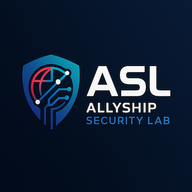
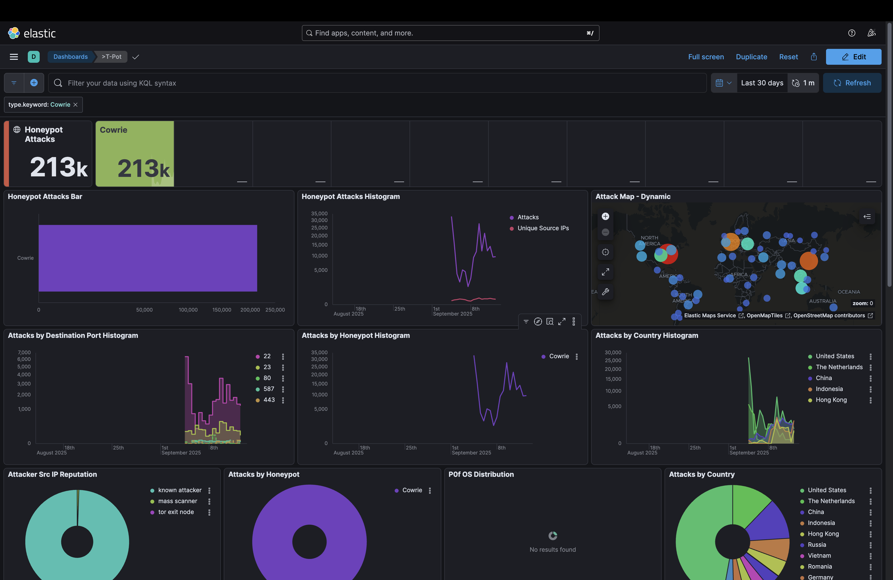
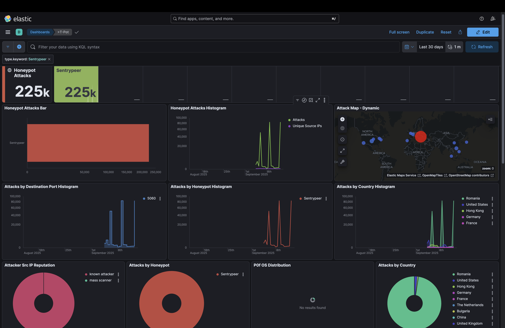
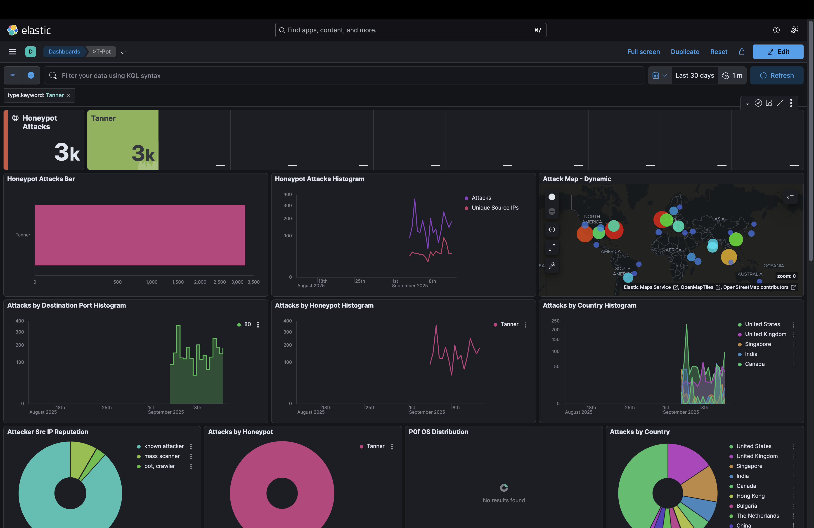
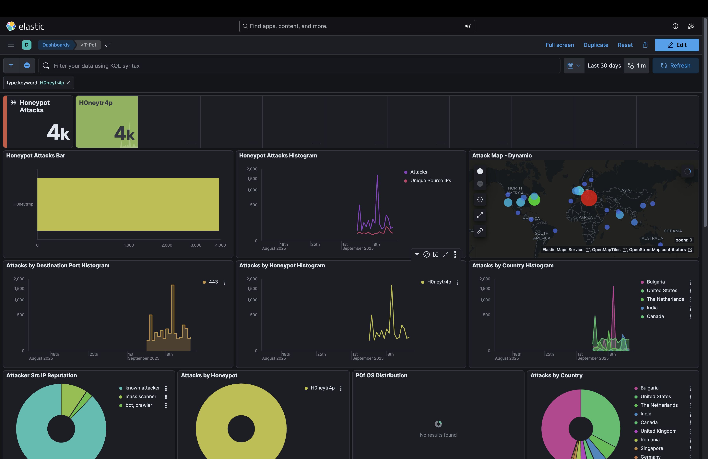
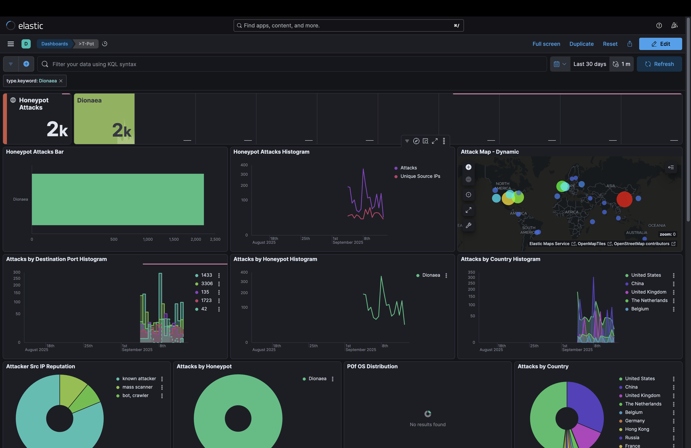
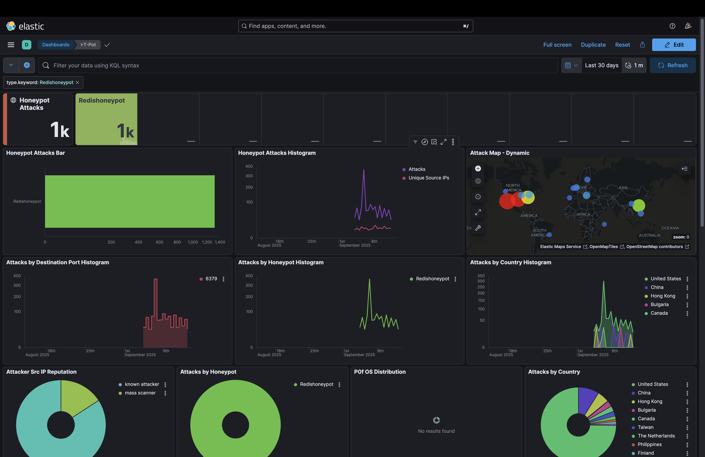
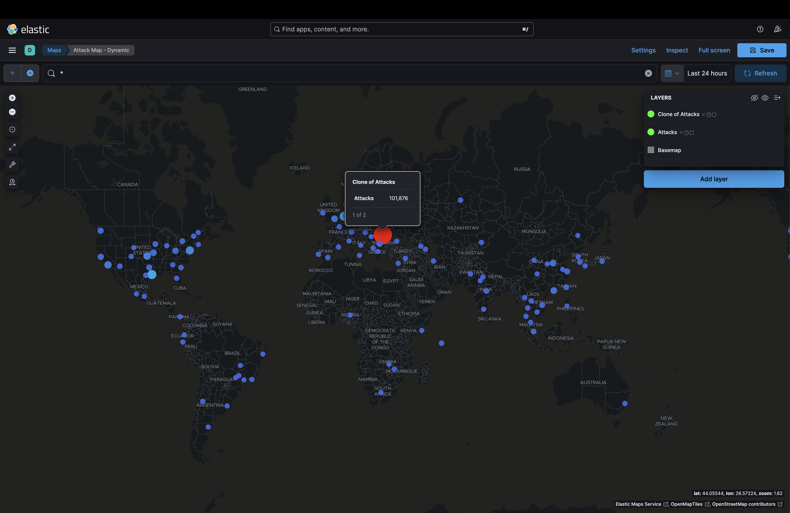
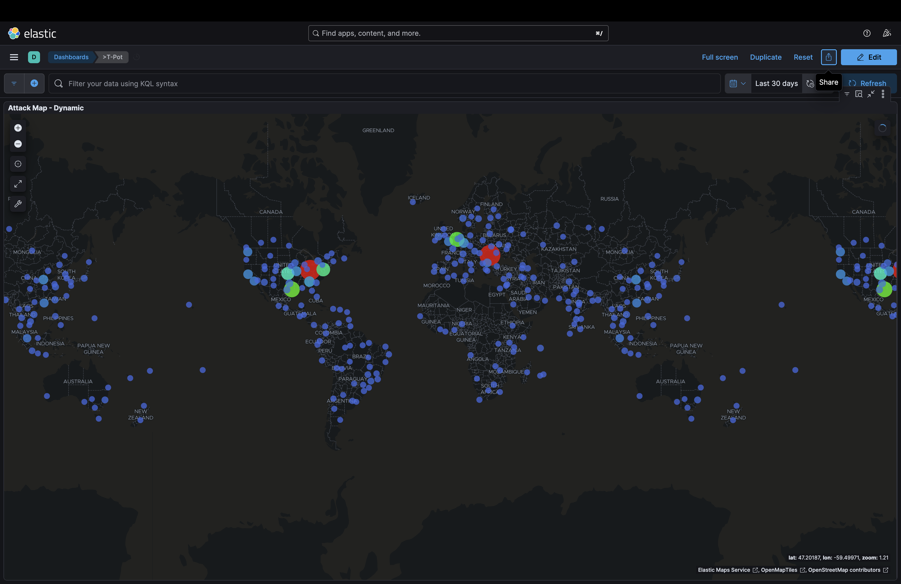

# 🛡️ Allyship Security Labs: Advanced T-Pot Honeypot with Zero-Trust Architecture

---

## 🚀 Project Overview

This research project deployed a **T-Pot honeypot on Azure** with enhanced security controls via **NetBird** and **Elastic Fleet Agents** to capture and analyze real-world cyber attacks while maintaining a **zero-trust architecture**. Over the final 7‑day run, the deployment captured **451,000+ attack attempts** across multiple honeypots. Additionally, **Elastic Fleet Agents** have collected **4.8+ million host monitoring events** from the T-Pot system, providing comprehensive visibility into both external attacks and internal system behavior through centralized Security Onion analysis.

> **🔄 Project Evolution**: This research builds upon my [Allyship Security Lab VPN - Cloud-Local SIEM](https://github.com/yourusername/allyship-securitylab-VpNSIEM) infrastructure, demonstrating the evolution from basic SIEM setup to advanced threat intelligence collection with enhanced security controls.

### 🎯 Key Technologies
- **T-Pot** - The All-In-One Multi Honeypot Platform
- **Azure VM** - Cloud infrastructure hosting
- **Security Onion** - Local SIEM for centralized analysis
- **Elastic Stack** - Kibana dashboard, Elasticsearch OSQuery for data storage and Host Queries
- **Let's Encrypt** - SSL/TLS certificate management
- **NetBird** - Zero-trust network access- Installed accross endpoints for NAT Passthrough, Secured Local/Cloud connections
- **Elastic Fleet Agents** - Behavioral monitoring and log forwarding from all Local/Cloud endpoints to SIEM.

## 🏗️ Architecture Evolution

This project represents the **next evolution** of my Allyship Security Labs infrastructure. While my previous project established secure network connectivity between environments using NetBird and Security Onion, this honeypot deployment demonstrates how to securely expose internet-facing services while maintaining complete visibility and control.

### 🔧 Enhanced Architecture Components
- **🔐 NetBird Zero-Trust Access**: Replaced direct SSH access with NetBird-managed WireGuard tunnels
- **📊 Elastic Fleet Integration**: Deployed agents to monitor host behavior and securely forward logs to local Security Onion
- **🎯 Comprehensive Threat Intelligence**: Captured and analyzed real-world attack patterns with behavioral context

## 🎯 Project Highlights

| Metric | Value | Description |
|--------|-------|-------------|
| 🎯 **Total Attacks (7 Days)** | 451,000+ | Final captured attacks across all sensors |
| 🐝 **Per‑Honeypot Totals** | Cowrie 213k • Sentrypeer 225k • Tanner 3k • H0neytr4p 4k • Dionaea 2k • Redishhoneypot 1k | From Kibana dashboards |
| 📊 **Host Events (7 Days)** | 4.8M+ | Elastic Fleet monitoring events |
| 🌍 **Top Countries** | Romania, United States, The Netherlands, China, Hong Kong | Leading attack sources |
| 🔐 **Zero-Trust** | ✅ | NetBird-managed access |
| 📊 **Dual Monitoring** | ✅ | Attack + Host behavior analysis |
| 🛡️ **Compliance** | ✅ | Azure & GDPR compliant |

### 🚀 Key Achievements
- **🎯 Captured 451,000+ attack attempts in 7 days** using a securely isolated honeypot
- **📊 Collected 4.8+ million host monitoring events** through Elastic Fleet Agents for comprehensive system visibility
- **🔐 Implemented zero-trust access model** with NetBird-managed WireGuard tunnels (replacing direct SSH access)
- **🔄 Dual monitoring architecture** combining external attack capture (T-Pot) with internal host behavior analysis (Elastic Fleet)
- **🔍 Analyzed attack patterns** including SIP attacks (port 5060), SSH brute-forcing (port 22), and web attacks (ports 80/443)
- **✅ Ensured compliance** with Azure terms of service and GDPR requirements for research data

## 🏛️ Technical Architecture

The enhanced T-Pot deployment features a multi-layered security architecture that goes beyond standard honeypot implementations:

### 🔄 Architecture Flow
1. **🌐 Attackers** → Target Azure VM (T-Pot honeypots)
2. **🕸️ T-Pot** → Captures and logs all attack attempts (451,000+ in 7 days)
3. **📊 Elastic Fleet Agents** → Monitor host behavior on T-Pot system (4.8M+ events)
4. **🔐 NetBird** → Secure WireGuard tunnels (100.66.x.x/16) for zero-trust data forwarding
5. **🛡️ Security Onion** → Centralized SIEM processing both attack data and host monitoring events

### 🧩 Key Components
- **🕸️ Honeypots**: Sentrypeer (~225k), Cowrie (~213k), H0neytr4p (~4k), Tanner (~3k), Dionaea (~2k), Redishhoneypot (~1k)
- **📊 Elastic Fleet Agents**: Process monitoring (1.7M events), file monitoring (1.4M events), network monitoring (875k events)
- **🔐 NetBird Security Layer**: Zero-trust access control and secure data forwarding
- **🛡️ Security Onion**: Centralized SIEM for dual monitoring (attacks + host behavior)

## 🔍 Key Findings (Final 7‑Day Data)

### 1. 🎯 SIP Attacks Dominate (Port 5060)
SIP attacks on port 5060 represented the **highest volume** with over **50,000 attacks** in a single day spike, indicating significant targeting of VoIP infrastructure.

### 2. 🌍 Romania Leads Attack Sources
**Romania** emerged as the **top attack source**, followed by the **United States**, **The Netherlands**, **China**, and **Hong Kong**.

### 3. 🔑 Honeypot Distribution
**Sentrypeer** and **Cowrie (SSH)** captured the majority of attacks with approximately **225,000** and **213,000** respectively, while other honeypots like **H0neytr4p (~4k)**, **Tanner (~3k)**, **Dionaea (~2k)**, and **Redishhoneypot (~1k)** recorded lower but notable volumes.

### 4. 🦠 Attack Volume Trends
The deployment shows **massive attack spikes** with single‑day bursts exceeding **50,000 attacks**, demonstrating the high-volume nature of automated attacks.

### 5. 📊 Comprehensive Host Monitoring
**Elastic Fleet Agents** collected **4.8+ million events** from the T-Pot host system, including:
- **1,754,395 process events** - Complete process monitoring and execution tracking
- **1,417,675 file events** - File system changes and access monitoring  
- **875,328 network events** - Internal network traffic analysis
- **1,021 session events** - User session and authentication tracking

This dual monitoring approach provides **complete visibility** into both external attack attempts and internal system behavior, enabling comprehensive threat analysis through the centralized Security Onion SIEM.

## 📸 Dashboards & Screenshots

> The following images are directly exported from Kibana and the T‑Pot map UI. Redactions were applied where appropriate.

| Honeypot | Dashboard |
|---|---|
| Cowrie |  |
| Sentrypeer |  |
| Tanner |  |
| H0neytr4p |  |
| Dionaea |  |
| Redishhoneypot |  |

## 📊 Final Metrics by Honeypot

| Honeypot | Approx. Attacks | Top Ports/Protocols | Notes |
|---|---:|---|---|
| Sentrypeer | 225,000 | 5060/UDP (SIP) | Repeated large spikes |
| Cowrie (SSH) | 213,000 | 22/TCP | Brute‑force usernames/passwords |
| H0neytr4p | 4,000 | 80/443 | Web probes and scanners |
| Tanner | 3,000 | 80/443 | Web application interactions |
| Dionaea | 2,000 | Multiple | Malware/protocol emulation |
| Redishhoneypot | 1,000 | 6379/TCP | Redis auth scans |

> See `data/samples/anonymized-attack-data.json` for a sample dataset and `data/export-scripts/backup-azure.sh` for export automation.

## 🔎 OSINT Enrichment (SpiderFoot)

Cross‑referenced attacker infrastructure using SpiderFoot for attribution hints while maintaining ethical constraints.

## 🔒 Security Enhancements

### 🔐 NetBird Access Control
Replaced direct SSH access with NetBird-managed WireGuard tunnels, implementing granular access policies for different user roles. This approach maintained secure access even when away from the home network while providing complete audit trails.

**Key Benefits:**
- ✅ Zero-trust network access with proper authentication
- ✅ Granular access policies for honeypot management
- ✅ Secure access from any location without VPN complexity
- ✅ Complete audit trail of all network connections

### 📊 Elastic Fleet Integration
Deployed Elastic Fleet Agents to monitor host behavior and configured secure log forwarding to the local Security Onion instance. This integration collected **4.8+ million events** in just 2 days, providing comprehensive behavioral analysis of the T-Pot system beyond traditional attack log analysis.

**Key Benefits:**
- ✅ **4.8M+ events collected** in 2 days from T-Pot host monitoring
- ✅ **Dual monitoring capability** - external attacks + internal host behavior
- ✅ **Secure log forwarding** via NetBird WireGuard tunnels to local SIEM
- ✅ **Comprehensive visibility** into process, file, network, and session events
- ✅ **Centralized analysis** through Security Onion for complete threat picture

### 🛡️ Zero-Trust Architecture
All devices connected via NetBird with proper access policies, ensuring no direct internet exposure for management interfaces and maintaining complete visibility into all network connections.

## ⚖️ Compliance and Ethical Considerations

This research project was conducted with strict adherence to professional and legal standards:

- **☁️ Azure Terms of Service**: Passive monitoring only, no active engagement with attackers
- **🔒 GDPR Requirements**: Data minimization, limited retention periods, anonymized analysis
- **⚖️ Ethical Standards**: No collection of personal data, focus on attack patterns and techniques
- **📋 Research Ethics**: Transparent methodology, responsible disclosure of findings

The NetBird security layer enhances compliance by providing controlled access and complete audit trails, ensuring all research activities are properly documented and authorized.

## 🚀 Getting Started

To replicate this research setup:

| Step | Description | Documentation |
|------|-------------|---------------|
| 1️⃣ | Set up NetBird infrastructure | [NetBird Integration](docs/security-enhancements/netbird-integration.md) |
| 2️⃣ | Create Azure VM | [VM Configuration](docs/azure-configuration/vm-configuration.md) |
| 3️⃣ | Configure NSG Rules | [NSG Rules](docs/azure-configuration/nsg-rules.md) |
| 4️⃣ | Install T-Pot | [Setup Guide](docs/setup-guide.md) |
| 5️⃣ | Secure with Let's Encrypt | [SSL Configuration](docs/azure-configuration/ssl-configuration.md) |
| 6️⃣ | Integrate with Elastic Fleet | [Elastic Fleet Setup](docs/security-enhancements/elastic-fleet-setup.md) |

## 📚 Documentation Links

| Category | Description | Links |
|----------|-------------|-------|
| 📋 **Setup** | Complete installation and configuration | [Full Setup Guide](docs/setup-guide.md) |
| ☁️ **Azure** | VM setup, NSG rules, and SSL configuration | [Azure Configuration](docs/azure-configuration/) |
| 🔒 **Security** | NetBird and Elastic Fleet integration | [Security Enhancements](docs/security-enhancements/) |
| 🔍 **Research** | Attack analysis and threat intelligence | [Research Findings](docs/research-findings/) |
| ✅ **Compliance** | Legal and ethical considerations | [Compliance Documentation](docs/compliance/) |

## 🤝 Contributing

This research project is archived but serves as a reference for cybersecurity professionals. For questions about methodology or implementation details, please open an issue or refer to the comprehensive documentation.

See [CONTRIBUTING.md](CONTRIBUTING.md) for guidelines on referencing this research.

## 📄 License

This project is licensed under the MIT License - see the [LICENSE](LICENSE) file for details.

**Copyright (c) 2024 Allyship Security Labs**

---

*This research was conducted as part of Allyship Security Labs' ongoing threat intelligence initiatives. All data collection and analysis was performed in compliance with applicable laws and ethical standards.*

**🛡️ Building a More Secure Digital Future**

